# Food Orders – test cases

## Positive test cases

### FO-POS-01 – Wylistowanie wszystkich zamówień

| Pole | Wartość |
|---|---|
| **Endpoint** | `/food-orders` |
| **Metoda** | `GET` |
| **Dane wejściowe** | Brak |
| **Oczekiwany wynik** | `200 OK` oraz lista zamówień wraz z ich atrybutami |
| **Wynik rzeczywisty** | `200 OK`, zwrócono listę zamówień |
| **Status** | PASS |
| **Uwagi** | Brak |

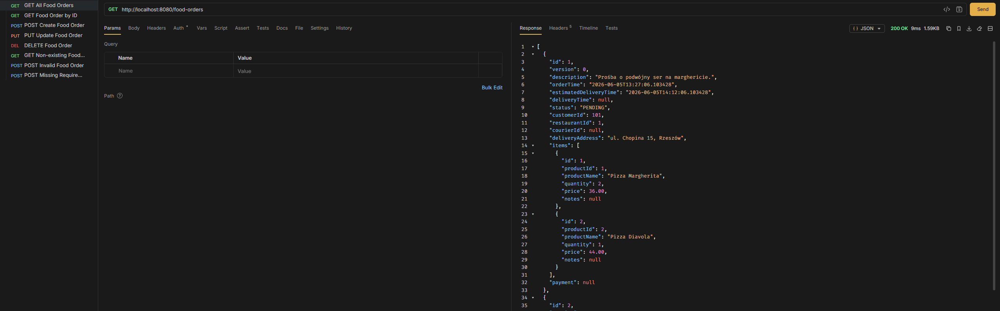

---

### FO-POS-02 – Wyszukanie zamówienia po ID

| Pole | Wartość |
|---|---|
| **Endpoint** | `/food-orders/2` |
| **Metoda** | `GET` |
| **Dane wejściowe** | Brak |
| **Oczekiwany wynik** | `200 OK` oraz zamówienie o ID = 2 |
| **Wynik rzeczywisty** | `200 OK`, zwrócono zamówienie o takim ID |
| **Status** | PASS |
| **Uwagi** | Brak |

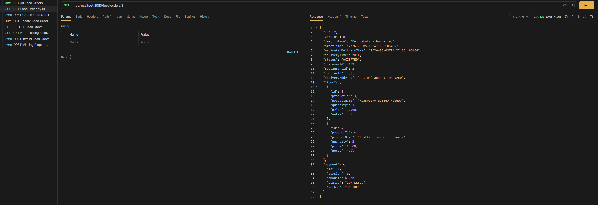

---

### FO-POS-03 – Utworzenie nowego zamówienia

| Pole | Wartość |
|---|---|
| **Endpoint** | `/food-orders` |
| **Metoda** | `POST` |
| **Dane wejściowe** | JSON z danymi nowego zamówienia |
| **Oczekiwany wynik** | `201 Created` oraz stworzenie i wyświetlenie nowego zamówienia |
| **Wynik rzeczywisty** | `201 Created`, stworzono zamówienie |
| **Status** | PASS |
| **Uwagi** | Brak nadania ID kurierowi, ponieważ API ignoruje pole `courierId` przesłane w body requestu `POST`. Pole nie jest obsługiwane w `CreateFoodOrderRequest`, przez co kurier nie zostaje przypisany podczas tworzenia zamówienia. |

**Dane wejściowe:**

```json
{
  "description": "Testowe zamówienie",
  "customerId": 101,
  "restaurantId": 1,
  "deliveryAddress": "ul. Testowa 1, Rzeszów",
  "courierId": 501,
  "status": "PENDING",
  "items": [
    {
      "productId": 1,
      "productName": "Pizza Margherita",
      "quantity": 2,
      "price": 36.00,
      "notes": "Bez cebuli"
    }
  ]
}
```

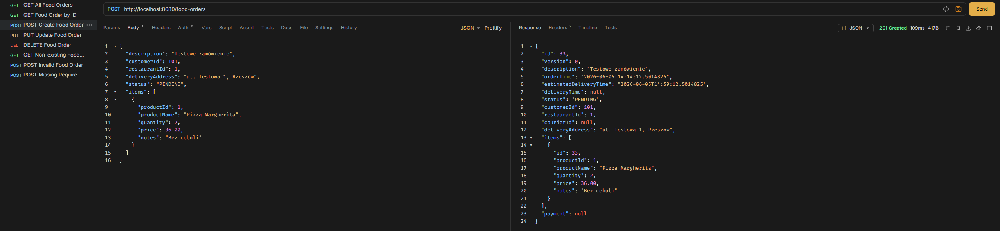

---

### FO-POS-04 – Aktualizacja zamówienia

| Pole | Wartość |
|---|---|
| **Endpoint** | `/food-orders/33` |
| **Metoda** | `PUT` |
| **Dane wejściowe** | JSON ze zmienionymi danymi zamówienia |
| **Oczekiwany wynik** | `200 OK` oraz aktualizacja i wyświetlenie zamówienia |
| **Wynik rzeczywisty** | `200 OK`, zaktualizowano zamówienie |
| **Status** | PASS |
| **Uwagi** | Po wykonaniu `PUT /food-orders/{id}` pola `orderTime` oraz `estimatedDeliveryTime` nie zostają zachowane. Aktualizacja nadpisuje encję danymi z zapytania, które nie zawiera tych pól. Status zamówienia nie został zmieniony przez `PUT`. Zmiana statusu prawdopodobnie powinna być wykonywana przez osobny endpoint `PATCH /food-orders/{id}/status`. |

**Dane wejściowe:**

```json
{
  "description": "Zmienione zamówienie testowe",
  "customerId": 101,
  "restaurantId": 1,
  "deliveryAddress": "ul. Testowa 10, Rzeszów",
  "courierId": 501,
  "status": "ACCEPTED",
  "items": [
    {
      "productId": 1,
      "productName": "Pizza Margherita",
      "quantity": 1,
      "price": 36.00,
      "notes": "Po aktualizacji"
    }
  ]
}
```

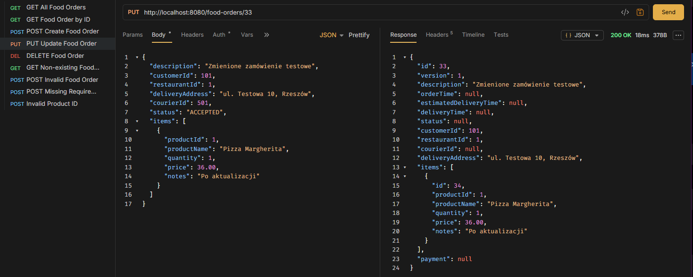

---

### FO-POS-05 – Usunięcie zamówienia

| Pole | Wartość |
|---|---|
| **Endpoint** | `/food-orders/33` |
| **Metoda** | `DELETE` |
| **Dane wejściowe** | Brak |
| **Oczekiwany wynik** | `204 No Content` |
| **Wynik rzeczywisty** | `204 No Content` |
| **Status** | PASS |
| **Uwagi** | Brak |

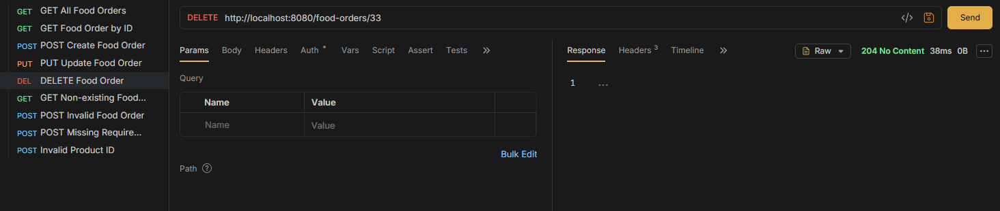

---

## Negative test cases

### FO-NEG-01 – Wyszukanie nieistniejącego zamówienia po ID

| Pole | Wartość |
|---|---|
| **Endpoint** | `/food-orders/420` |
| **Metoda** | `GET` |
| **Dane wejściowe** | Brak |
| **Oczekiwany wynik** | `404 Not Found` |
| **Wynik rzeczywisty** | `404 Not Found` |
| **Status** | PASS |
| **Uwagi** | Brak |

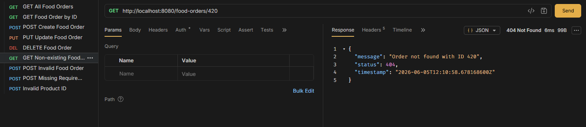

---

### FO-NEG-02 – Utworzenie niepoprawnego zamówienia

| Pole | Wartość |
|---|---|
| **Endpoint** | `/food-orders` |
| **Metoda** | `POST` |
| **Dane wejściowe** | JSON z niepoprawnymi danymi zamówienia |
| **Oczekiwany wynik** | `400 Bad Request` i wyświetlenie wiadomości o błędzie walidacji |
| **Wynik rzeczywisty** | `400 Bad Request` i wiadomość o błędzie walidacji |
| **Status** | PASS |
| **Uwagi** | API zwraca informację, że adres dostawy oraz nazwa produktu nie mogą być puste, a ilość oraz cena muszą być dodatnie. |

**Dane wejściowe:**

```json
{
  "description": "",
  "customerId": -1,
  "restaurantId": -5,
  "courierId": -10,
  "deliveryAddress": "",
  "status": "WRONG_STATUS",
  "items": [
    {
      "productId": -1,
      "productName": "",
      "quantity": -2,
      "price": -36.00,
      "notes": "Test błędnych danych"
    }
  ]
}
```

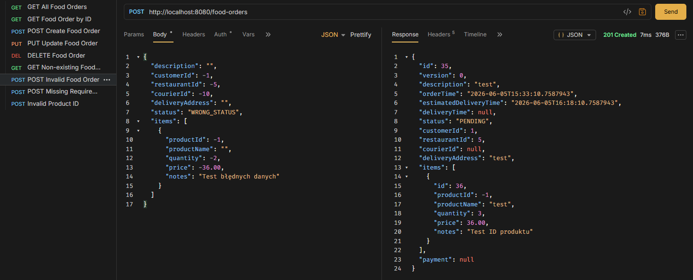

---

### FO-NEG-03 – Utworzenie zamówienia z brakującymi polami

| Pole | Wartość |
|---|---|
| **Endpoint** | `/food-orders` |
| **Metoda** | `POST` |
| **Dane wejściowe** | JSON zawierający tylko opis zamówienia |
| **Oczekiwany wynik** | `400 Bad Request` i wyświetlenie wiadomości o błędzie walidacji |
| **Wynik rzeczywisty** | `400 Bad Request` i wiadomość o błędzie walidacji |
| **Status** | PASS |
| **Uwagi** | API wymaga podania adresu dostawy, produktu, ID klienta oraz ID restauracji do stworzenia zamówienia. |

**Dane wejściowe:**

```json
{
  "description": "Zamówienie bez wymaganych pól"
}
```

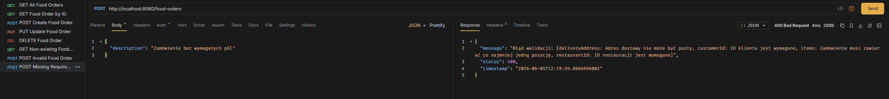

---

### FO-NEG-04 – Utworzenie zamówienia z ujemnym ID produktu

| Pole | Wartość |
|---|---|
| **Endpoint** | `/food-orders` |
| **Metoda** | `POST` |
| **Dane wejściowe** | JSON z ujemnym `productId` |
| **Oczekiwany wynik** | `400 Bad Request` i wyświetlenie wiadomości o błędzie walidacji |
| **Wynik rzeczywisty** | `201 Created`, utworzono zamówienie |
| **Status** | FAIL |
| **Uwagi** | API pozwala na utworzenie zamówienia z ujemnym ID produktu. |

**Dane wejściowe:**

```json
{
  "description": "test",
  "customerId": 1,
  "restaurantId": 5,
  "courierId": 10,
  "deliveryAddress": "test",
  "status": "WRONG_STATUS",
  "items": [
    {
      "productId": -1,
      "productName": "test",
      "quantity": 2,
      "price": 36.00,
      "notes": "Test błędnych danych"
    }
  ]
}
```

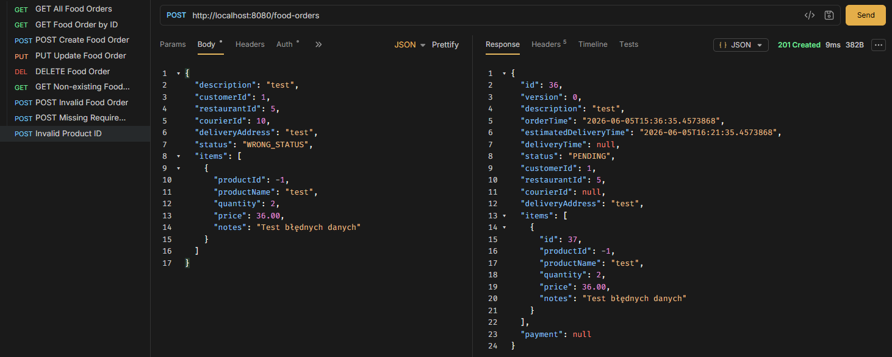

## Process test cases

### FO-PROC-01 – Zmiana statusu zamówienia na ACCEPTED

| Pole | Wartość |
|---|---|
| **Endpoint** | `/food-orders/37/status?status=ACCEPTED` |
| **Metoda** | `PATCH` |
| **Dane wejściowe** | Parametr query: `status=ACCEPTED` |
| **Oczekiwany wynik** | `200 OK` oraz zmiana statusu zamówienia na `ACCEPTED` |
| **Wynik rzeczywisty** | `200 OK`, status zamówienia został zmieniony na `ACCEPTED` |
| **Status** | PASS |
| **Uwagi** | Brak |

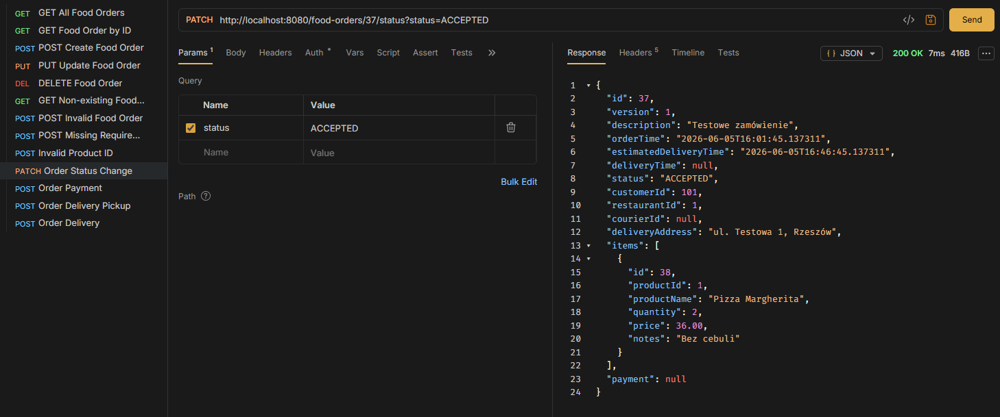

---

### FO-PROC-02 – Opłacenie zamówienia

| Pole | Wartość |
|---|---|
| **Endpoint** | `/food-orders/37/pay?method=ONLINE&amount=72.00` |
| **Metoda** | `POST` |
| **Dane wejściowe** | Brak |
| **Oczekiwany wynik** | `200 OK` oraz oznaczenie zamówienia jako opłacone |
| **Wynik rzeczywisty** | `200 OK` oraz ustawienie atrybutów płatności |
| **Status** | PASS |
| **Uwagi** | Brak |

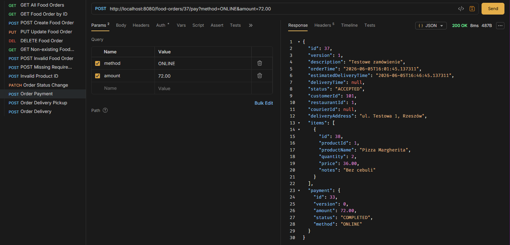

---

### FO-PROC-03 – Odbiór zamówienia przez kuriera

| Pole | Wartość |
|---|---|
| **Endpoint** | `/food-orders/37/pickup?courierId=10` |
| **Metoda** | `POST` |
| **Dane wejściowe** | Brak |
| **Oczekiwany wynik** | `200 OK` oraz zmiana statusu zamówienia na `IN_DELIVERY` |
| **Wynik rzeczywisty** | `200 OK`, zmiana statusu zamówienia z `ACCEPTED` na `IN_DELIVERY` |
| **Status** | PASS |
| **Uwagi** | Brak |


---

### FO-PROC-04 – Dostarczenie zamówienia

| Pole | Wartość |
|---|---|
| **Endpoint** | `/food-orders/37/deliver` |
| **Metoda** | `POST` |
| **Dane wejściowe** | Brak |
| **Oczekiwany wynik** | `200 OK` oraz zmiana statusu zamówienia na `DELIVERED` |
| **Wynik rzeczywisty** | `200 OK`, zmiana statusu zamówienia z `IN_DELIVERY` na `DELIVERED` |
| **Status** | PASS |
| **Uwagi** | Brak |

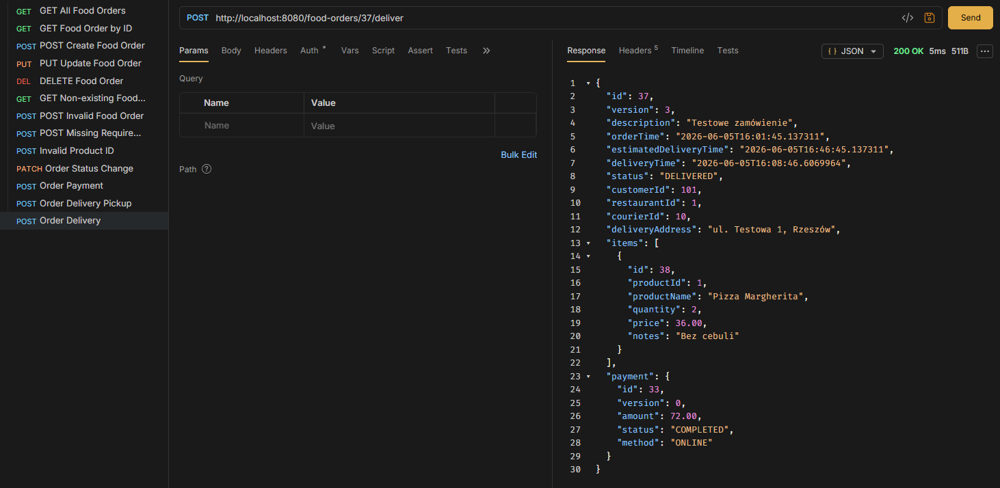
